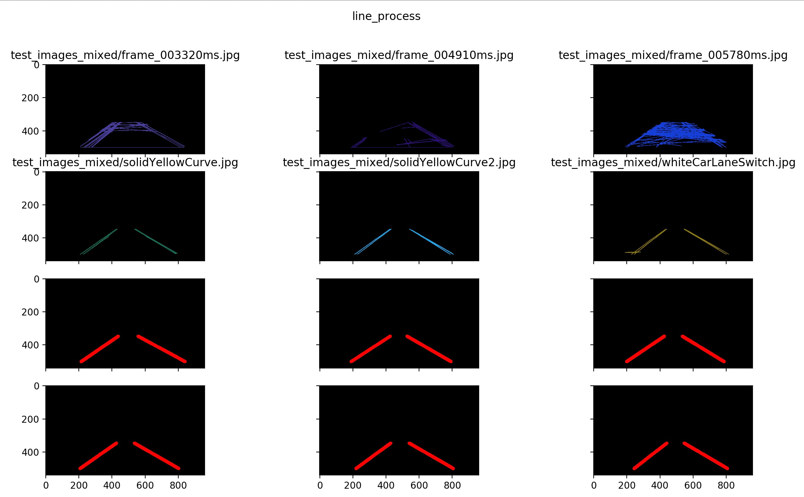
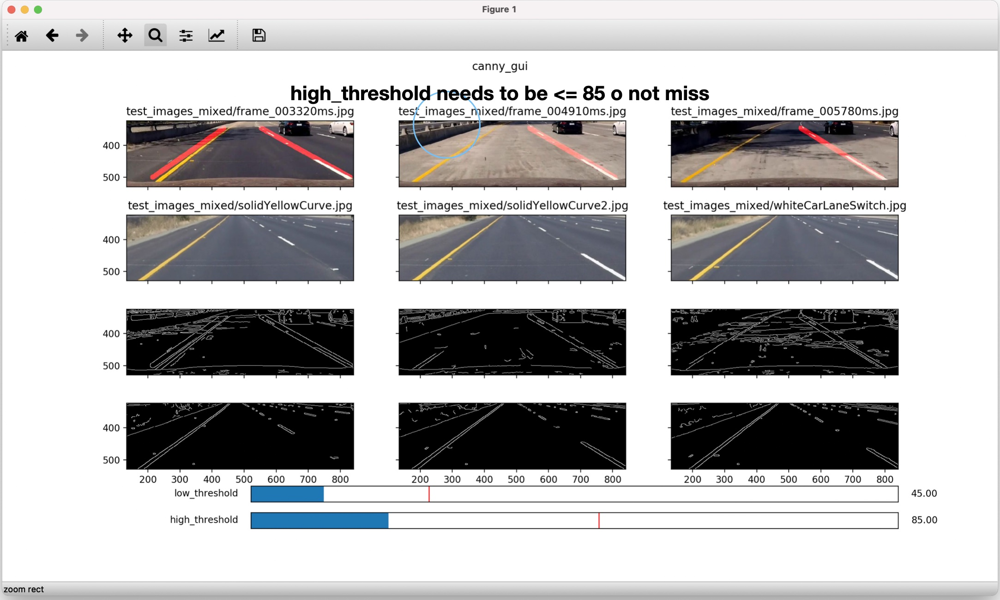
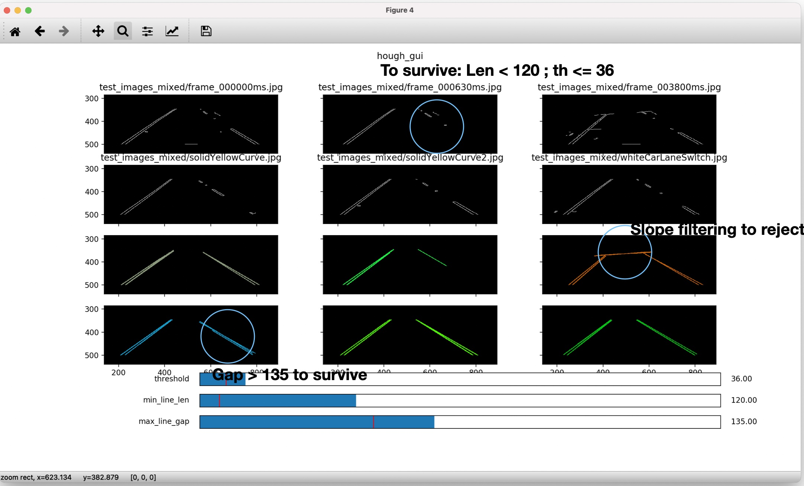
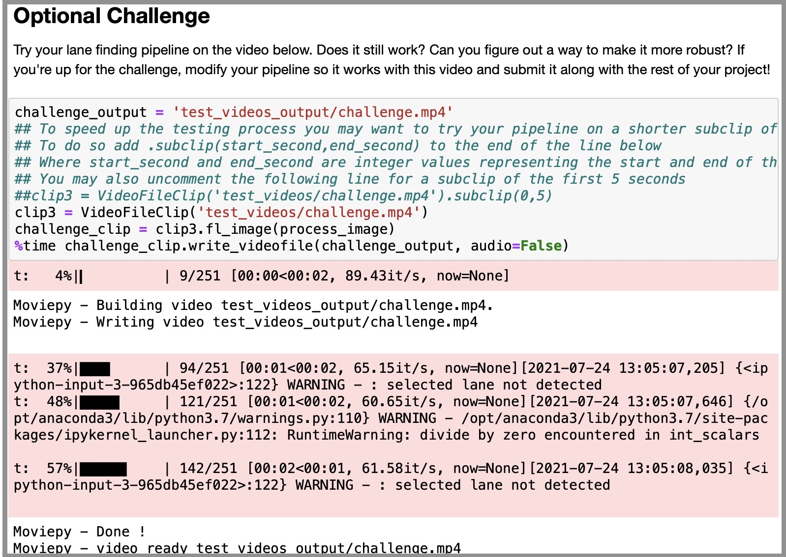
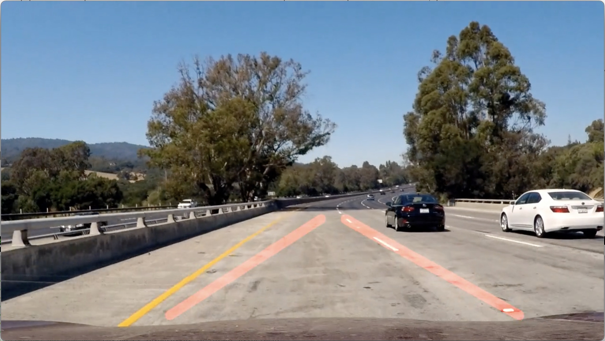

# **Finding Lane Lines on the Road** 

## 1. Pipeline

To find lane lines from the video stream, I developed a pipeline to process each incoming frame consisted of 5 steps: 

* Convert the images to grayscale; 
* Perform Canny edge detection after blurring the grayscale image;
* Create a mask for my region of interest (ROI) to bound the straight line detection for lane detection; 
* In that ROI, perform Hough transform to find all the lines. 
* Filtering the lines based on slope and classify to left lane, right lane, or else; For left or right lane, average over the two longest lines (or just pick the one if there is only one line detected); Draw the line on image spanning to the top and bottom of the ROI. 

### Modifications to draw single line for left/right lane
Many lines are detected after the HoughLinesP function. I performed the following modifications so that finally there is only one line drawn on left and right each:

* I let "hough_lines" return all lines detected;
* "lines_process": filtering the line: 
    * for each line, compute the slope, y-intersection, and length;
    * use the slope to classify whether this line belongs to left lane, right lane, or else; 
    * for left lane category, pick the longest 1 (if only 1 in total) or 2 lines, and averaging the slope/y-intersection;
    * do the same for the right lane category;
* generate left and right lines spanning to the ROI: compute the x values for given y boundaries of the ROI.

**Example screenshot of line_process input (top two rows) and output (bottom tow rows) is shown below:**:



### Parameter Tuning Strategy
I created an offline GUI program with sliders to quickly find parameters.

#### Canny edge detction: 
* Keep the high threshold low enough to miss weak lanes.
* Raise the low threshold to about 1/3 ~ 1/2  of the high threshold to filter out non-lane edges. 



#### ROI: 
Crop it smaller to avoid the bottom invalid area in the video and the top part with curvy lanes and complications.

#### Hough line detection
We will do the lines filtering afterwards, and in this step, we can relax parameters so as to not miss detection: lower down threshold and min line length.

* max line gap: set to longest gap in between line segements.
* min line length: set to shortest longest line segment in the challenge.mp4: 25 or so.
* threshold set to the same value



#### Lines filtering

We can reject non-lane lines such as the boundary of newly paved roads or from shadows, based on the fact that lanes have their slope/y-intercept within a normal range. This is especially important for "challenge.mp4" -- we relax Hough line detection parameters to not miss real lanes but will rely more heavlity on some post-filtering like done here to reject non-lane lines.

* slope filtering. Slope was found to be within the range of: [-0.87 -0.67] [0.52 0.63]; or to give more clearance: [-0.95, -0.60]; [0.45, 0.75]. This is implemented in ```line_process``` to categorize all lines to left, or right, or else.

### Adjusting pipeline for "challenge.mp4"
#### Extract the failure frames and add them for parameter re-tuning
I created a folder "test_images_mixed/" to contain 3 of 6 previous test images and 3 of frames from "challenge.mp4":

    rm -v test_images_mixed/frame_*.jpg 
    ./extract_frames.py # where I extract the failure frames using time stamps

#### Adjust ROI
I noticed the relative camera position on car looks a little different, and bottom part of these frames see part of the front of the car. I shrink the ROI and adjust the vertices.

#### Deal with differnt image sizes
* previous images/videos: 960 x 540: 
* Challenge.mp4: 1280 x 720; 

My solution: 
* Don't assume they are of the same size
* For tuning purposes resize the video to get absolute coordinate, then convert to normalized coordinates

Resize with ImageMagick:

    ls test_images_mixed/frame_*.jpg | while read img; do
        convert "$img" -resize 960x540 "$img"
    done

##### Canny/Hough parameter retune
Go back and retune parameters using this new set of images (mixed).

See the next section of Parameter Tuning Strategy for my summary.

## 2. Potential shortcomings of the current pipeline
When I tested my pipeline on the "challenge.mp4", several problems still exist from checking the logging information as well as the output video.

* Missed detection can happen under challenging frames.
* "Divide by zero" issue when I try to compute the slope and classify whether a line belongs to left/right: 
* Wrong detection of lines when there complicated texture on the road which happens for some frames of the "challenge.mp4".
* Some jittering of the detected lanes without any temporal filtering;

**Screenshot of the logging is shown below: **



**An example of wrong detection is shown below:** 



## 3. Possible improvements to my pipeline
* Improve robustness by temporal filtering: I can create a rolling window (size of 3 or 5) to store the detected left and right lane in the newest 3 or 5 frames. And store a rolling median from these 5 numbers.
    * When miss detection happens, I can substitute with the rolling median; 
    * When wrong detection happens, which can be determined by the slope/y-intercept values of the line exceeding a certain range or showing a big discrepancy with the rolling median, then it is possible that it is a wrong detection and I can substitue with the rolling median. 
* Slope/y-intercept lines filter: I have already done the slope filtering. I can narrow down the range and also create an additional filter for y-intercept to further reject wrong lines. 
